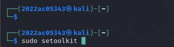

# Name: Pushpendra Singh                       
# BITS ID: 2022ac05343


# Assignment2: Simulate Two Cyber Attacks using the Social-Engineer Toolkit (SET)


# **1. Cloning a Default Website and Harvesting Credentials:**

## Overall Process Description & Solution Approach:

- The goal is to demonstrate how attackers can clone a legitimate website to create a phishing page and harvest user credentials.
- The approach involves using SET to clone a website and host a fake login page that logs entered credentials.

## Tool Used: Social-Engineer Toolkit (SET)

- **Reason for Use:** SET is designed for social engineering and includes modules for easily cloning websites and setting up credential harvesters.

## Details of Each Command Executed:

1. Start SET tool:

```bash
sudo setoolkit
```
2. Select option `[1] Social-Engineering Attacks`
3. Select option `[2] Website Attack Vectors`
4. Select option `[3] Credential Harvester Attack Method`
5. Select option `[1] Web Template`
6. Select option `[3] Twitter`
7. Enter the IP address where the harvester will listen (local IP)

## Final Output Results and Analysis:

- **Output:** A URL hosting the cloned website with a fake login form.
- **Analysis:** Any credentials entered into the fake form are logged, demonstrating the ease of phishing attacks and the importance of user awareness and caution with login forms.

## Screenshot of the output:




## Alternative Tools:

- **Gophish:** An open-source phishing toolkit designed for businesses and penetration testers.
- **Phishing Frenzy:** A Ruby on Rails phishing framework.


# **2. Creating a Payload for Reverse TCP using Meterpreter:**

## Overall Process Description & Solution Approach:

- The goal is to demonstrate how an attacker can create a payload to establish a reverse TCP connection using Meterpreter for remote access.
- The approach involves using SET to create a payload that, when executed on a target machine, opens a reverse TCP connection to the attacker's machine.

## Tool Used: Social-Engineer Toolkit (SET)

- **Reason for Use:** SET simplifies the creation of various payloads, including those that leverage Meterpreter for reverse TCP connections.

## Details of Each Command Executed:

1. Start SET tool:

```bash
sudo setoolkit
```
2. Select option `[1] Social-Engineering Attacks`
3. Select option `[4] Create a Payload and Listener`
4. Select option `[2] Windows Reverse_TCP Meterpreter`
5. Enter IP address for the payload listerner (LHOST): (local IP)
6. Enter the PORT for the reverse listerner: (4444)
7. Start the listener

## Final Output Results and Analysis:

- **Output:** A payload file (payload.exe) and a listening Meterpreter session.
- **Analysis:** If the payload is executed on a target machine, it establishes a reverse TCP connection to the attacker's machine, allowing remote control. This demonstrates the importance of endpoint security and cautious execution of unknown files.

## Screenshot of the output:


## Alternative Tools:

- **Metasploit Framework:** Directly create payloads and listeners using msfvenom and msfconsole.
- **Veil Framework:** A tool for generating payloads that bypass common antivirus solutions.
